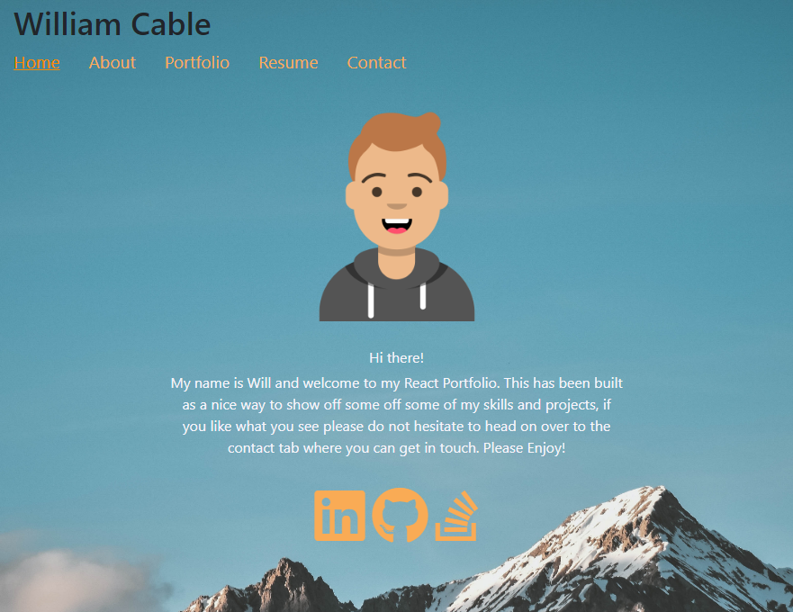

# React Portfolio

## Description

- Being a Web Developer means being part of a community. This portfolio was built as a place to showcase my projects, but also as a way to share my work with fellow developers and collaborate on future projects.
- By creating this portfolio, it allows for all of my projects to be showcased using a platform outside of Github and as a result provides a greater user experience when navigating my career profile.
- By building this app, it has allowed me to learn (and demonstrate) my skills in React and web-design, including but not limited to: Rendering, Props, Components, States, Event Handling, Hooks, Data-Fetching, Styling and Testing.

## Table of Contents

- [Installation](#installation)
- [Usage](#usage)
- [Credits](#credits)
- [License](#license)

## Installation

Simply copy the HTML or SSH Key and clone the respository to your own PC!

## Usage

Live Site:
https://cableman687.github.io/react_portfolio/

Click the tabs at the top of the site to navigate through each section of the portfolio. 
To download the author resume, navigate to the Portfolio page and click the link provided beneath the header. 
To contact the author, navigate to the Contact page and fill out all fields (Name, Email, Message) before clicking the submit button.

## License

MIT

## How to Contribute

This repository is not open for public contribution.
